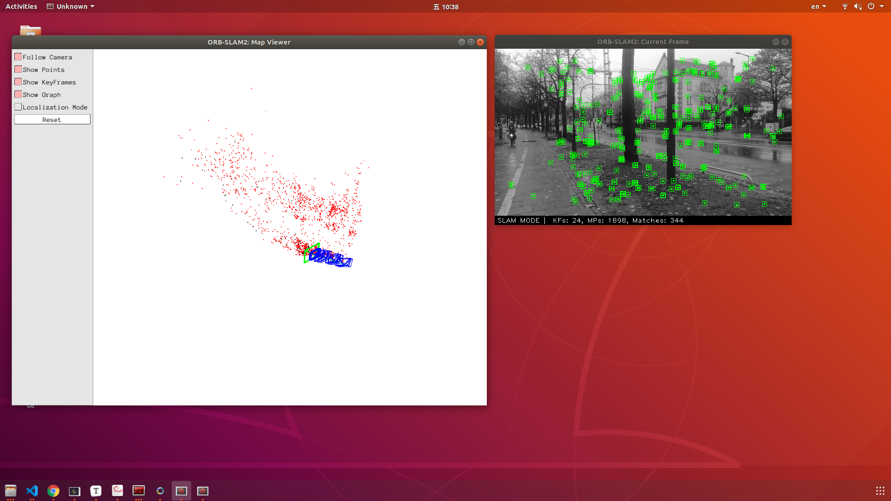
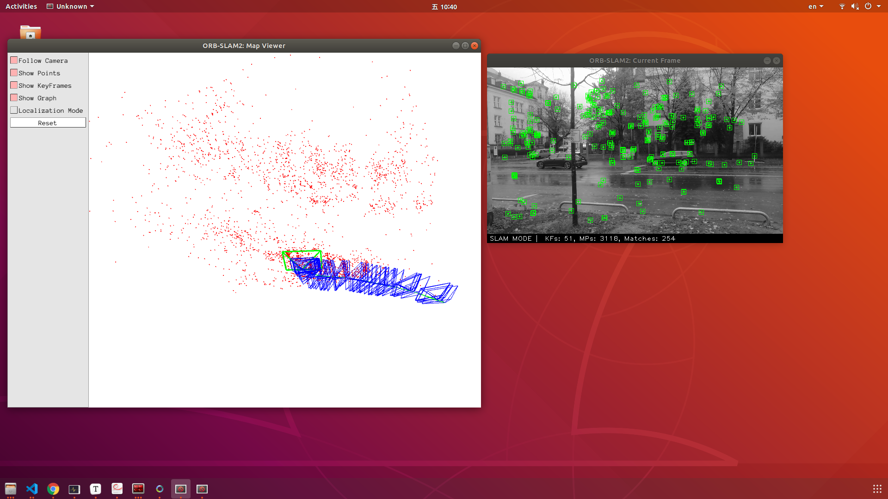

### Linux 基础

1. 如何在 Ubuntu 中安装软件(命令行界面)?它们通常被安装在什么地方?

   > ```bash
   > sudo apt install <package>
   > ```
   >
   > 一般会安装到`/usr/local`目录下

2. linux 的环境变量是什么?我如何定义新的环境变量?

   > ```bash
   > export PATH=/path
   > ```
   >
   > 可以通过`export`命令定义新的环境变量

3. linux 根目录下面的目录结构是什么样的?至少说出 3 个目录的用途。

   > ```bash
   > /
   > ├── bin				# 存放系统命令的目录，普通用户和超级用户都可以执行。单用户可执行，类似于win的安全模式
   > ├── boot			# 系统启动目录
   > ├── dev				# 设备文件，包括硬件
   > ├── etc				# 配置文件存放目录
   > ├── home			# 宿主用户目录
   > ├── lib				# 系统调用的函数库保存位置
   > ├── lib64			
   > ├── lost+found
   > ├── media			# 挂载目录(类似于win的盘符)，媒体设备
   > ├── mnt
   > ├── opt				# 第三方安装的软件保存位置，但习惯把软件放置到/usr/local/目录中
   > ├── proc
   > ├── root			# root目录
   > ├── run
   > ├── sbin
   > ├── snap
   > ├── srv
   > ├── swapfile
   > ├── sys
   > ├── tmp
   > ├── usr				# Unix Software Resource 缩写，不是user,存放系统软件资源目录
   > ├── var				# 动态数据保存位置，缓存、日志、软件文件
   > ```

4. 假设我要给 a.sh 加上可执行权限,该输入什么命令?

   > ```bash
   > chmod +x a.sh
   > ```

5. 假设我要将 a.sh 文件的所有者改成 xiang:xiang,该输入什么命令?

   > ```bash
   > sudo chown xiang:xiang a.sh
   > ```

### SLAM 综述文献阅读

1. SLAM 会在哪些场合中用到?至少列举三个方向。
   
   > 机器人、AR、自动驾驶
   
2. SLAM 中定位与建图是什么关系?为什么在定位的同时需要建图?

   >  Initially, mapping and localization were studied independently, later it was recognized that they are dependent. This means that, for being precisely localized in an environment, a correct map is necessary, but in order to construct a good map it is necessary to be properly localized when elements are added to the map.

3. SLAM 发展历史如何?我们可以将它划分成哪几个阶段?

   > |Stage|Topic|
   > |:---:|:---:|
   > |classical age (1986-2004)|Probabilistic approachesnd data association|
   > |algorithmic-analysis age (2004-2015)|Observability, consistency and convergence|
   > |robust-perception age (2015-future)|robust performance, high-level understanding, resource awareness, task-driven inference|

4. 列举三篇在 SLAM 领域的经典文献。
   > [1] Georg Klein and David Murray, "Parallel Tracking and Mapping for Small AR Workspaces", Proc. ISMAR 2007
   >
   > [2] Mourikis A, Roumeliotis S. A multi-state constraint Kalman fil-ter for vision-aided inertial navigation[C] //Proceedings of IEEE International Conference on obotics and Automation. Los Alamitos: IEEE Computer Society Press, 2007: 3565-3572
   >
   > [3]  T. Qin, P. Li and S. Shen, "VINS-Mono: A Robust and Versatile Monocular Visual-Inertial State Estimator," in IEEE Transactions on Robotics, vol. 34, no. 4, pp. 1004-1020, Aug. 2018, doi: 10.1109/TRO.2018.2853729.

### CMake 练习
   > [CMake Practice](./code/cmake_practice/CMakeLists.txt)
### ORB-SLAM2
   > [ORB SLAM2](./code/ORB_SLAM2/)

以生成的 `mono_euroc` 为例，依赖的库有：

```bash
   $ readelf -d mono_euroc 

   Dynamic section at offset 0xeb58 contains 36 entries:
   Tag        Type                         Name/Value
   0x0000000000000001 (NEEDED)             Shared library: [libORB_SLAM2.so]
   0x0000000000000001 (NEEDED)             Shared library: [libopencv_imgcodecs.so.3.2]
   0x0000000000000001 (NEEDED)             Shared library: [libopencv_core.so.3.2]
   0x0000000000000001 (NEEDED)             Shared library: [libpangolin.so]
   0x0000000000000001 (NEEDED)             Shared library: [libOpenGL.so.0]
   0x0000000000000001 (NEEDED)             Shared library: [libGLEW.so.2.0]
   0x0000000000000001 (NEEDED)             Shared library: [libstdc++.so.6]
   0x0000000000000001 (NEEDED)             Shared library: [libgcc_s.so.1]
   0x0000000000000001 (NEEDED)             Shared library: [libc.so.6]
```

### 附加题
   > [ORB SLAM2 Video](./code/ORB_SLAM2/Examples/Video/)

   

   

