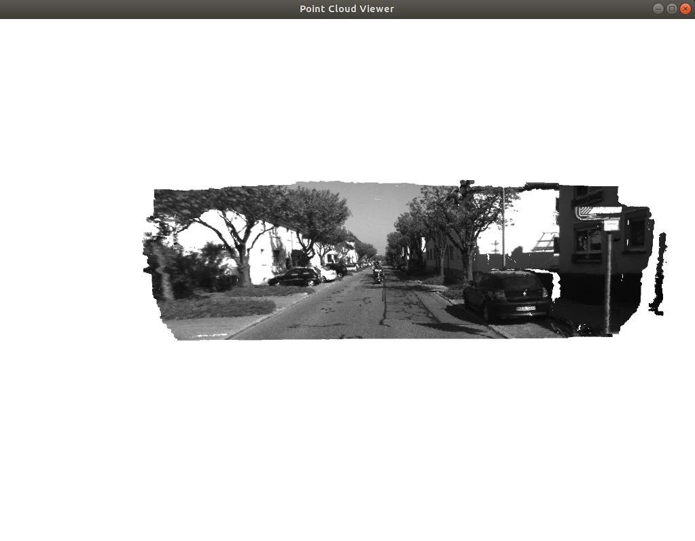
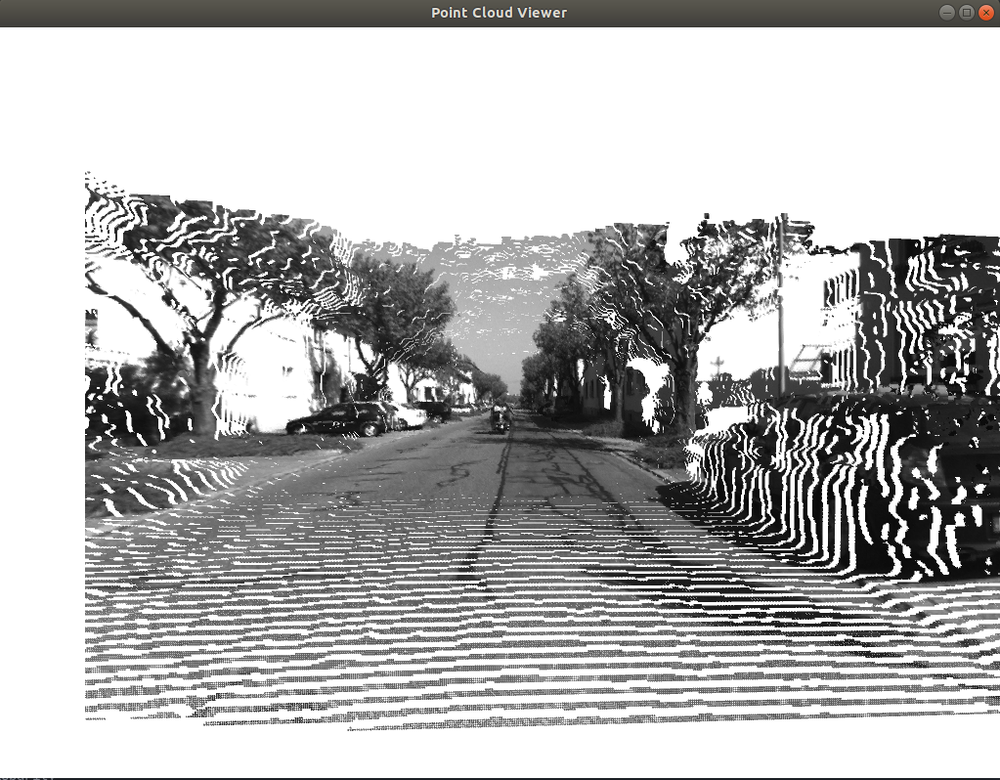

## PA4 Solution
---

### 图像去畸变

```c++
double u_distorted = 0, v_distorted = 0;
// TODO 按照公式，计算点(u,v)对应到畸变图像中的坐标(u_distorted, v_distorted) (~6 lines)
// start your code here
double xc = (u - cx) / fx;
double yc = (v - cy) / fy;
double r2 = xc * xc + yc * yc;
double x_distorted = xc * (1 + k1 * r2 + k2 * r2 * r2) + 2 * p1 * xc * yc + p2 * (r2 + 2 * xc * xc);
double y_distorted = yc * (1 + k1 * r2 + k2 * r2 * r2) + p1 * (r2 + 2 * yc * yc) + 2 * p2 * xc * yc;a
u_distorted = fx * x_distorted + cx;
v_distorted = fy * y_distorted + cy;
// end your code here
```
公式里的 $x$ 和 $y$ 为相机坐标系下的，所以需要先变换到相机坐标系下算出畸变坐标之后再投影到像素坐标系


---

### 双目视差

```c++
// start your code here (~6 lines)
// 根据双目模型计算 point 的位置
double z = fx * d / disparity.at<uchar>(v, u);
point.x() = (u - cx) * z / fx;
point.y() = (v - cy) * z / fy;
point.z() = z;
pointcloud.push_back(point);
// end your code here
```
根据双目视差先计算出深度，然后再计算出相机坐标系下的 $x$ 和 $y$





---

### 曲线拟合

曲线方程为

$$
y = exp(ax^2 + bx + c)
$$

误差定义为
$$
e_{i} = y_{i} - exp(ax_{i}^2 + bx_i + c)
$$

则误差对参数的雅可比为
$$
\begin{aligned}
    \frac{de}{da} = & - exp(ax^2 + bx_i + c) * x^2 \\
    \frac{de}{db} = & - exp(ax^2 + bx_i + c) * x    \\
    \frac{de}{dc} = & - exp(ax^2 + bx_i + c)    \\
\end{aligned}
$$

利用GN法求解
```c++
for (int i = 0; i < N; i++) {
    double xi = x_data[i], yi = y_data[i];  // 第i个数据点
    // start your code here
    double error = 0;   // 第i个数据点的计算误差
    double est = exp(ae * xi * xi + be * xi + ce);
    error = yi - est; // 填写计算error的表达式
    Vector3d J; // 雅可比矩阵
    J[0] = -est * xi * xi;  // de/da
    J[1] = -est * xi;  // de/db
    J[2] = -est;  // de/dc

    H += J * J.transpose(); // GN近似的H
    b += -error * J;
    // end your code here

    cost += error * error;
}

Vector3d dx;
dx = H.ldlt().solve(b);
// end your code here
```
```bash
total cost: 3.19575e+06
total cost: 376785
total cost: 35673.6
total cost: 2195.01
total cost: 174.853
total cost: 102.78
total cost: 101.937
total cost: 101.937
total cost: 101.937
total cost: 101.937
total cost: 101.937
total cost: 101.937
total cost: 101.937
cost: 101.937, last cost: 101.937
estimated abc = 0.890912, 2.1719, 0.943629
```
---

### 批量最大似然估计

离散时间系统

$$
\begin{aligned}
    x_k =& x_{k-1} + v_k + w_k \\
    y_k =& x_k + n_k
\end{aligned}
$$

批量状态变量为 $x=[x_0, x_1, x_2, x_3]^T$

批量观测为 $z=[v_1, v_2, v_3, y_1, y_2, y_3]^T$

定义矩阵 $H$, 使得批量误差为 $e = z - Hx$， 则 $H$ 为

$$
H =
\begin{bmatrix}
    -1& 1& 0& 0\\
    0& -1& 1& 0\\
    0& 0& -1& 1\\
    0& 1& 0& 0\\
    0& 0& 1& 0\\
    0& 0& 0& 1
\end{bmatrix}
$$

---
### 矩阵微积分

[矩阵微积分Wiki](https://zh.wikipedia.org/zh-cn/%E7%9F%A9%E9%98%B5%E5%BE%AE%E7%A7%AF%E5%88%86#%E7%9F%A9%E9%98%B5%E6%B1%82%E5%AF%BC)
* 向量对标量求导
  $$
  {\displaystyle {\frac {\partial \mathbf {y} }{\partial x}}={\begin{bmatrix}{\frac {\partial y_{1}}{\partial x}}\\{\frac {\partial y_{2}}{\partial x}}\\\vdots \\{\frac {\partial y_{m}}{\partial x}}\\\end{bmatrix}}}
  $$
* 标量对向量求导
  $$
  {\displaystyle {\frac {\partial y}{\partial \mathbf {x} }}={\begin{bmatrix}{\frac {\partial y}{\partial x_{1}}}&{\frac {\partial y}{\partial x_{2}}}&\cdots &{\frac {\partial y}{\partial x_{n}}}\end{bmatrix}}}
  $$
* 向量对向量求导
  $$
  {\displaystyle {\frac {\partial \mathbf {y} }{\partial \mathbf {x} }}={\begin{bmatrix}{\frac {\partial y_{1}}{\partial x_{1}}}&{\frac {\partial y_{1}}{\partial x_{2}}}&\cdots &{\frac {\partial y_{1}}{\partial x_{n}}}\\{\frac {\partial y_{2}}{\partial x_{1}}}&{\frac {\partial y_{2}}{\partial x_{2}}}&\cdots &{\frac {\partial y_{2}}{\partial x_{n}}}\\\vdots &\vdots &\ddots &\vdots \\{\frac {\partial y_{m}}{\partial x_{1}}}&{\frac {\partial y_{m}}{\partial x_{2}}}&\cdots &{\frac {\partial y_{m}}{\partial x_{n}}}\\\end{bmatrix}}}
  $$
* 矩阵对标量求导
  $$
  {\displaystyle {\frac {\partial \mathbf {Y} }{\partial x}}={\begin{bmatrix}{\frac {\partial y_{11}}{\partial x}}&{\frac {\partial y_{12}}{\partial x}}&\cdots &{\frac {\partial y_{1n}}{\partial x}}\\{\frac {\partial y_{21}}{\partial x}}&{\frac {\partial y_{22}}{\partial x}}&\cdots &{\frac {\partial y_{2n}}{\partial x}}\\\vdots &\vdots &\ddots &\vdots \\{\frac {\partial y_{m1}}{\partial x}}&{\frac {\partial y_{m2}}{\partial x}}&\cdots &{\frac {\partial y_{mn}}{\partial x}}\\\end{bmatrix}}}
  $$
* 标量对矩阵求导
  $$
  {\displaystyle {\frac {\partial y}{\partial \mathbf {X} }}={\begin{bmatrix}{\frac {\partial y}{\partial x_{11}}}&{\frac {\partial y}{\partial x_{21}}}&\cdots &{\frac {\partial y}{\partial x_{p1}}}\\{\frac {\partial y}{\partial x_{12}}}&{\frac {\partial y}{\partial x_{22}}}&\cdots &{\frac {\partial y}{\partial x_{p2}}}\\\vdots &\vdots &\ddots &\vdots \\{\frac {\partial y}{\partial x_{1q}}}&{\frac {\partial y}{\partial x_{2q}}}&\cdots &{\frac {\partial y}{\partial x_{pq}}}\\\end{bmatrix}}}
  $$