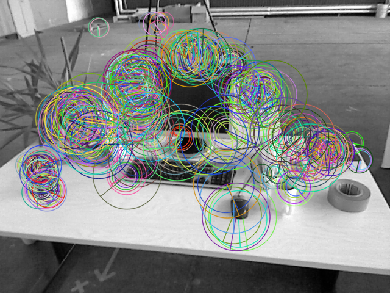
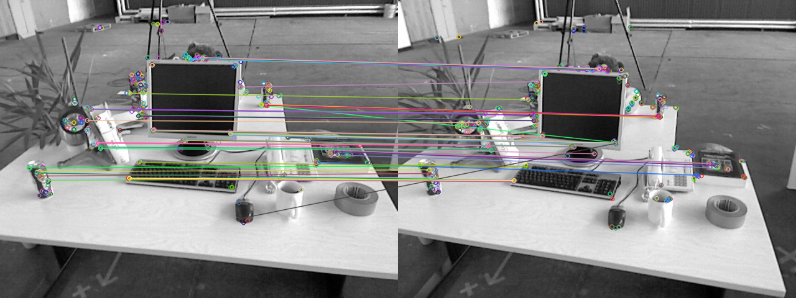
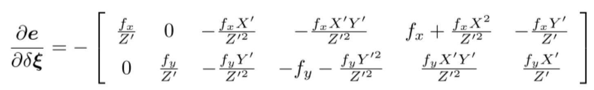
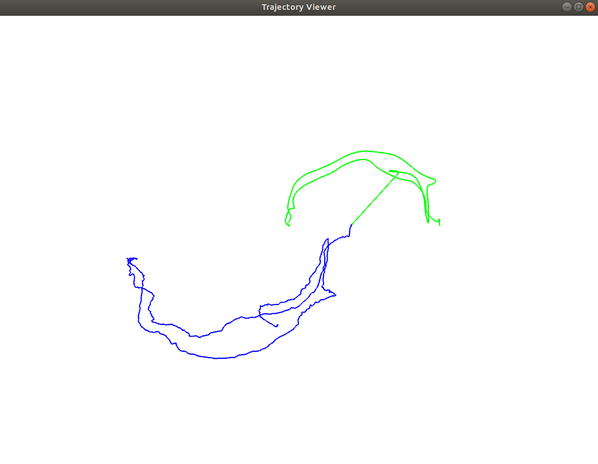
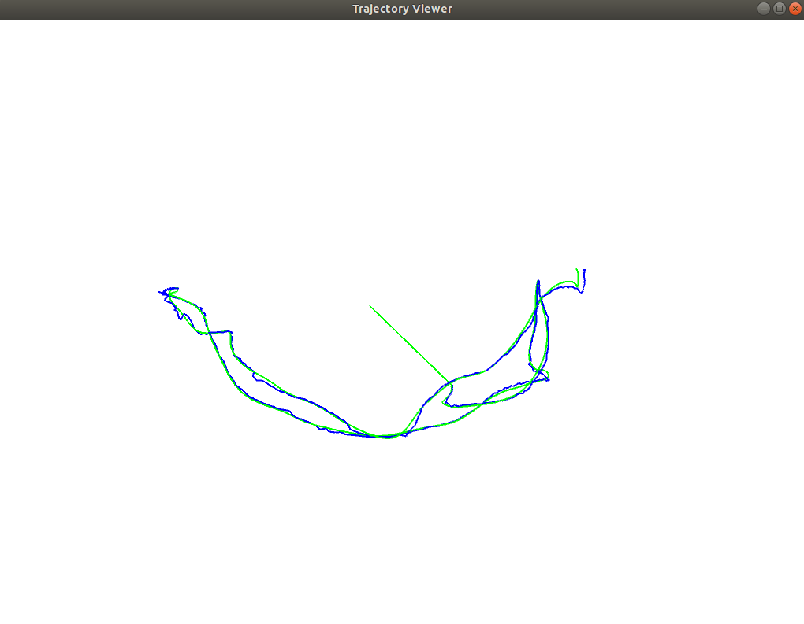

## PA5-Solution
---

### [ORB特征点](../code/computeORB.cpp)

* feat
  
* match
  
---
### [本质矩阵](../code/E2Rt.cpp)
```bash
U
-0.0890846  -0.562354  -0.822084
  0.993441  -0.109576 -0.0326974
-0.0716928  -0.819605   0.568426
V
  0.556696 -0.0369821   0.829892
 0.0601827   0.998179 0.00411052
  0.828533 -0.0476569  -0.557908
A
   0.707107
   0.707107
1.29353e-16
Diag
0.707107        0        0
       0 0.707107        0
       0        0        0
R1 = 
  -0.365887  -0.0584576    0.928822
-0.00287461    0.998092   0.0616849
   0.930655  -0.0198997    0.365356
R2 = 
 -0.998596  0.0516992 -0.0115267
-0.0513961   -0.99836 -0.0252005
 0.0128107  0.0245727  -0.999616
t1 = 
 -0.581301
-0.0231206
  0.401938
t2 = 
 0.581301
0.0231206
-0.401938
t^R = 
 -0.0203619   -0.400711  -0.0332407
   0.393927   -0.035064    0.585711
-0.00678849   -0.581543  -0.0143826
```
---
### [BundleAdjustment](../code/GN-BA.cpp)
* 重投影误差
  
  可以定义为测量值减去估计值
  $$
  e = y - K*T_{est}*P
  $$
* 误差关于自变量雅可比
  
  

* 更新
  
  以`SE3d`为例：
  ```c++
  T_esti =  Sophus::SE3d::exp(dx) * T_esti;
  ```

  
```bash
$ ./GN-BA 
points: 76
1 0 0 0
0 1 0 0
0 0 1 0
0 0 0 1
iteration 0 cost=599.187
dx :   -0.121534 -0.00625545   0.0624059  -0.0260197   0.0379231   0.0495528
iteration 1 cost=5.43695
dx :  -0.00730621   0.00108129  -0.00374198 -0.000520855   0.00271731   0.00160654
iteration 2 cost=3.96516
dx :  2.52359e-05 -1.26018e-05 -4.24307e-06  -6.3472e-06 -7.76555e-06  -8.2157e-06
iteration 3 cost=3.96514
dx :   2.2932e-08  2.92055e-08 -5.85084e-09  1.71617e-08  -1.3471e-08 -2.53791e-09
iteration 4 cost=3.96514
dx :  1.95957e-10  3.06509e-11  -2.9508e-11  1.53639e-11 -1.11571e-10  4.63023e-11
iteration 5 cost=3.96514
dx :   7.0863e-13  6.19491e-13 -7.57938e-14  3.64415e-13 -4.06941e-13  1.27187e-13
iteration 6 cost=3.96514
dx :   4.2941e-15  1.75644e-15  -5.4768e-16  9.95132e-16 -2.43526e-15   1.0047e-15
iteration 7 cost=3.96514
dx :  2.42333e-17  1.86251e-17  8.46942e-17  1.38323e-17 -2.10348e-17 -5.14223e-18
iteration 8 cost=3.96514
dx :   9.9816e-17 -3.47527e-18 -2.54072e-16  -1.1936e-17 -5.68009e-17  4.43793e-17
cost: 3.96514, last cost: 3.96514
estimated pose: 
  0.997866 -0.0516724  0.0399128  -0.127227
 0.0505959    0.99834  0.0275274 -0.0075068
-0.0412689 -0.0254492   0.998824  0.0613861
         0          0          0          1
```
---
### [ICP](../code/icp_align.cpp)

|               Before               |           After           |
| :--------------------------------: | :-----------------------: |
|  |  |
