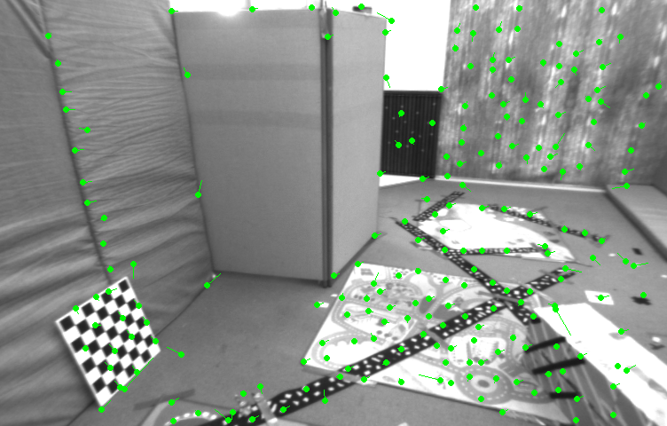
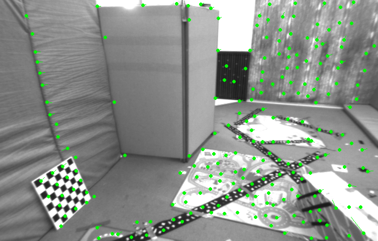

## PA6-Solution
---
### LK光流
#### 光流分类
  - additive or compositional
  - forward or inverse
#### 光流实现

| Type | Forward | Inverse |
| :--: | :-----: | :-----:|
| single |  |  |
| multi |  |  | 

 - track by opencv

  

### 直接法

  直接法误差项为窗口内的像素误差和，是个标量，对自变量的雅可比维度为**1x6**，通过链式求导法则可得

  $$
  \begin{aligned}
    J = - \frac{\partial{I}}{\partial{u}}\cdot\frac{\partial{u}}{\partial\xi}
  \end{aligned}
  $$
  第一项为像素梯度，第二项为之前讲过误差相对于自变量的雅可比(2x6)

  ```c++
    error = GetPixelValue(img1,px_ref[i][0]+x,px_ref[i][1]+y)-GetPixelValue(img2,u+x,v+y);

    Matrix26d J_pixel_xi;   // pixel to \xi in Lie algebra
    J_pixel_xi.setZero();
    J_pixel_xi(0, 0) = fx / z_cur;
    J_pixel_xi(0, 2) = -fx * x_cur / (z_cur * z_cur);
    J_pixel_xi(0, 3) = -(fx * x_cur * y_cur) / (z_cur * z_cur);
    J_pixel_xi(0, 4) = fx + (fx * x_cur * x_cur) / (z_cur * z_cur);
    J_pixel_xi(0, 5) = -fx * y_cur / z_cur;
    J_pixel_xi(1, 1) = fy / z_cur;
    J_pixel_xi(1, 2) = -fy * y_cur / (z_cur * z_cur);
    J_pixel_xi(1, 3) = - fy - fy * y_cur * y_cur / (z_cur * z_cur);
    J_pixel_xi(1, 4) = fy * x_cur * y_cur / (z_cur * z_cur);
    J_pixel_xi(1, 5) = fy * x_cur / z_cur;

    Eigen::MatrixXd J_img_pixel = Eigen::MatrixXd::Zero(1, 2);    // image gradients
    J_img_pixel(0, 0) = 0.5 * (GetPixelValue(img2, u + x + 1, v + y) - GetPixelValue(img2, u + x - 1, v + y));
    J_img_pixel(0, 1) = 0.5 * (GetPixelValue(img2, u + x, v + y + 1) - GetPixelValue(img2, u + x, v + y - 1));
    // total jacobian
    Eigen::MatrixXd J = Eigen::MatrixXd::Zero(1, 6);
    J = -1.0 * J_img_pixel * J_pixel_xi;
    H += J.transpose() * J;
    b += -J.transpose() * error;
  ```
  计算结果与验证结果非常接近
  ```bash
  $ ./direct_method 
  Processing : ../000001.png
  T_cur_ref : 
    0.999991  0.00241208  0.00336827 -0.00205359
  -0.00241943    0.999995  0.00218103  0.00288558
  -0.00336299 -0.00218916    0.999992   -0.724257
            0           0           0           1

  Processing : ../000002.png
  T_cur_ref : 
    0.999973  0.00139623  0.00718078   0.0078223
  -0.00142322    0.999992  0.00375612  0.00149511
  -0.00717548 -0.00376624    0.999967    -1.45801
            0           0           0           1

  Processing : ../000003.png
  T_cur_ref : 
    0.999937  0.00166398   0.0110686  0.00895973
  -0.00172141    0.999985  0.00518043 0.000881808
  -0.0110598 -0.00519916    0.999925    -2.20837
            0           0           0           1

  Processing : ../000004.png
  T_cur_ref : 
      0.999874   0.00041145    0.0158558   0.00947835
  -0.000505138     0.999982   0.00590519  -0.00207108
    -0.0158531  -0.00591246     0.999857     -2.99371
            0            0            0            1

  Processing : ../000005.png
  T_cur_ref : 
    0.999806  0.00113819   0.0196626    0.026641
  -0.00126702    0.999978   0.0065408  -0.0103336
  -0.0196547 -0.00656445    0.999785    -3.79962
            0           0           0           1
  ```
