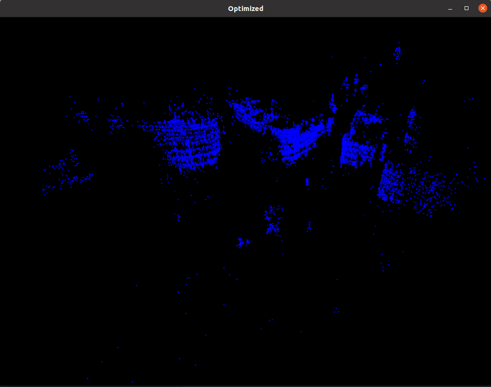
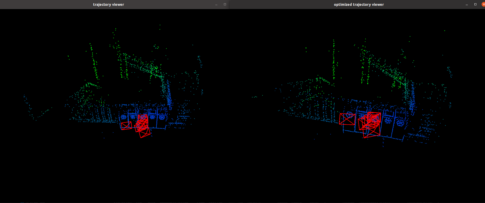
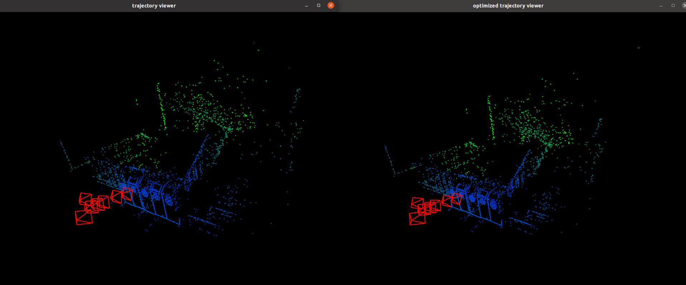

## PA7-Solution
---
### Bundle Adjustment

以 Trafalgar Dataset problem-21-11315-pre.txt 数据为例

[bal_example](../code/bal_example.cpp)



代码中实现了g2o数值求导和ceres的自动求导，对比发现ceres自动求导(~9s/iter)比g2o数值求导(~15s/iter)要快一点，但是每次迭代优化耗时都比较长，具体原因还在寻找中

### 直接法BA

* 添加位姿节点
  ```c++
  for (size_t i = 0; i < poses.size(); i++) {
      VertexSophus *v = new VertexSophus();
      v->setEstimate(poses[i]);
      v->setId(i);
      optimizer.addVertex(v);
  }
  ```
* 添加Landmark节点
  ```c++
  for (size_t i = 0; i < points.size(); i++) {
      g2o::VertexPointXYZ *vertex_p = new g2o::VertexPointXYZ();
      vertex_p->setId(i + poses.size());
      vertex_p->setEstimate(points[i]);
      vertex_p->setMarginalized(true);
      optimizer.addVertex(vertex_p);
  }
  ```
* 添加观测误差边
  
  由于给的数据不知道每个路标点是否能被每个位姿观测到，所以添加边时先遍历位姿和路标点，再在计算误差时判断点是否在图像中
  ```c++
  for (size_t i = 0; i < poses.size(); i++) {
      for (size_t j = 0; j < points.size(); j++) {
          EdgeDirectProjection *edge = new EdgeDirectProjection(color[j], images[i]);
          // edge->setId(j);
          edge->setVertex(0, dynamic_cast<g2o::VertexPointXYZ*>(optimizer.vertex(j + poses.size())));
          edge->setVertex(1, dynamic_cast<VertexSophus*>(optimizer.vertex(i)));
          edge->setInformation(Eigen::Matrix<double, 16, 16>::Identity());

          g2o::RobustKernelHuber* huber_kernel = new g2o::RobustKernelHuber();
          huber_kernel->setDelta(1.0);
          edge->setRobustKernel(huber_kernel);
          optimizer.addEdge(edge);
      }
  }

  virtual void computeError() override {
      // TODO START YOUR CODE HERE
      const g2o::VertexPointXYZ* v_pw = static_cast<const g2o::VertexPointXYZ*>(vertex(0));
      const VertexSophus* T_cw = static_cast<const VertexSophus*>(vertex(1));
      Eigen::Vector3d p_c = T_cw->estimate() * v_pw->estimate();
      float x = p_c.x() / p_c.z() * fx + cx;
      float y = p_c.y() / p_c.z() * fy + cy;
      if ((x - 3) < 0 || (x + 2) > targetImg.cols || 
              (y - 3) < 0 || (y + 2) > targetImg.rows) {
          _error(0, 0) = 0.0;
          this->setLevel(1);
      } else {            
          for (int u = -2; u < 2; u++) {
              for (int v = -2; v < 2; v++) {
                  int num = 4 * u + v + 10;
                  _error[num] = origColor[num] - GetPixelValue(targetImg, x + u, y + v);
              }
          }
      }
      // END YOUR CODE HERE
  }
  ```
* 优化结果
  ```bash
  iteration= 0     chi2= 3745816.683904    time= 13.2592   cumTime= 13.2592        edges= 28826    schur= 1        lambda= 57480645.537792         levenbergIter= 1
  iteration= 1     chi2= 3740233.780665    time= 13.0502   cumTime= 26.3094        edges= 28826    schur= 1        lambda= 38320430.358528         levenbergIter= 1
  iteration= 2     chi2= 3736071.504228    time= 13.129    cumTime= 39.4384        edges= 28826    schur= 1        lambda= 25546953.572352         levenbergIter= 1
  iteration= 3     chi2= 3731987.593591    time= 13.1639   cumTime= 52.6023        edges= 28826    schur= 1        lambda= 17031302.381568         levenbergIter= 1
  iteration= 4     chi2= 3729769.809086    time= 13.219    cumTime= 65.8213        edges= 28826    schur= 1        lambda= 11354201.587712         levenbergIter= 1
  iteration= 5     chi2= 3726441.271313    time= 13.1382   cumTime= 78.9595        edges= 28826    schur= 1        lambda= 7569467.725141  levenbergIter= 1
  iteration= 6     chi2= 3724956.108009    time= 13.1182   cumTime= 92.0777        edges= 28826    schur= 1        lambda= 5046311.816761  levenbergIter= 1
  iteration= 7     chi2= 3723692.148679    time= 13.2099   cumTime= 105.288        edges= 28826    schur= 1        lambda= 3364207.877841  levenbergIter= 1
  iteration= 8     chi2= 3723117.611677    time= 14.7673   cumTime= 120.055        edges= 28826    schur= 1        lambda= 17942442.015150         levenbergIter= 3
  iteration= 9     chi2= 3721952.580466    time= 13.0816   cumTime= 133.137        edges= 28826    schur= 1        lambda= 11961628.010100         levenbergIter= 1
  iteration= 10    chi2= 3721839.970729    time= 13.95     cumTime= 147.087        edges= 28826    schur= 1        lambda= 15948837.346800         levenbergIter= 2
  iteration= 11    chi2= 3720446.555785    time= 13.0697   cumTime= 160.156        edges= 28826    schur= 1        lambda= 10632558.231200         levenbergIter= 1
  iteration= 12    chi2= 3720394.130036    time= 13.1929   cumTime= 173.349        edges= 28826    schur= 1        lambda= 7088372.154133  levenbergIter= 1
  iteration= 13    chi2= 3720098.374517    time= 14.8498   cumTime= 188.199        edges= 28826    schur= 1        lambda= 37804651.488711         levenbergIter= 3
  iteration= 14    chi2= 3719390.905550    time= 13.18     cumTime= 201.379        edges= 28826    schur= 1        lambda= 25203100.992474         levenbergIter= 1
  iteration= 15    chi2= 3718960.546452    time= 14.0333   cumTime= 215.412        edges= 28826    schur= 1        lambda= 33604134.656632         levenbergIter= 2
  iteration= 16    chi2= 3716437.647113    time= 13.1152   cumTime= 228.527        edges= 28826    schur= 1        lambda= 22402756.437755         levenbergIter= 1
  iteration= 17    chi2= 3714517.189489    time= 13.2253   cumTime= 241.753        edges= 28826    schur= 1        lambda= 14935170.958503         levenbergIter= 1
  iteration= 18    chi2= 3714213.879434    time= 13.1884   cumTime= 254.941        edges= 28826    schur= 1        lambda= 9956780.639002  levenbergIter= 1
  iteration= 19    chi2= 3713525.542748    time= 15.6223   cumTime= 270.563        edges= 28826    schur= 1        lambda= 424822640.597419        levenbergIter= 4
  iteration= 20    chi2= 3712260.955188    time= 13.3466   cumTime= 283.91         edges= 28826    schur= 1        lambda= 283215093.731613        levenbergIter= 1
  iteration= 21    chi2= 3710171.471571    time= 13.1039   cumTime= 297.014        edges= 28826    schur= 1        lambda= 188810062.487742        levenbergIter= 1
  iteration= 22    chi2= 3709759.280576    time= 13.192    cumTime= 310.206        edges= 28826    schur= 1        lambda= 125873374.991828        levenbergIter= 1
  iteration= 23    chi2= 3707963.875205    time= 13.4853   cumTime= 323.691        edges= 28826    schur= 1        lambda= 83915583.327885         levenbergIter= 1
  iteration= 24    chi2= 3707144.423407    time= 13.3824   cumTime= 337.074        edges= 28826    schur= 1        lambda= 55943722.218590         levenbergIter= 1
  iteration= 25    chi2= 3706581.926808    time= 13.3911   cumTime= 350.465        edges= 28826    schur= 1        lambda= 37295814.812393         levenbergIter= 1
  iteration= 26    chi2= 3705213.196631    time= 13.4107   cumTime= 363.876        edges= 28826    schur= 1        lambda= 24863876.541596         levenbergIter= 1
  iteration= 27    chi2= 3704472.089934    time= 13.3676   cumTime= 377.243        edges= 28826    schur= 1        lambda= 16575917.694397         levenbergIter= 1
  iteration= 28    chi2= 3701537.957081    time= 13.3892   cumTime= 390.632        edges= 28826    schur= 1        lambda= 11050611.796265         levenbergIter= 1
  iteration= 29    chi2= 3701131.904257    time= 15.9154   cumTime= 406.548        edges= 28826    schur= 1        lambda= 471492769.973961        levenbergIter= 4
  iteration= 30    chi2= 3699412.512009    time= 13.2753   cumTime= 419.823        edges= 28826    schur= 1        lambda= 314328513.315974        levenbergIter= 1
  iteration= 31    chi2= 3698434.760143    time= 13.3123   cumTime= 433.135        edges= 28826    schur= 1        lambda= 209552342.210650        levenbergIter= 1
  iteration= 32    chi2= 3697459.284236    time= 13.4143   cumTime= 446.55         edges= 28826    schur= 1        lambda= 139701561.473766        levenbergIter= 1
  iteration= 33    chi2= 3696330.609303    time= 13.2339   cumTime= 459.783        edges= 28826    schur= 1        lambda= 93134374.315844         levenbergIter= 1
  iteration= 34    chi2= 3695526.217194    time= 13.3247   cumTime= 473.108        edges= 28826    schur= 1        lambda= 62089582.877229         levenbergIter= 1
  iteration= 35    chi2= 3693652.081295    time= 13.4215   cumTime= 486.53         edges= 28826    schur= 1        lambda= 41393055.251486         levenbergIter= 1
  iteration= 36    chi2= 3693241.754475    time= 14.2418   cumTime= 500.771        edges= 28826    schur= 1        lambda= 55190740.335315         levenbergIter= 2
  iteration= 37    chi2= 3693046.902927    time= 15.8307   cumTime= 516.602        edges= 28826    schur= 1        lambda= 2354804920.973443       levenbergIter= 4
  iteration= 38    chi2= 3692294.527453    time= 13.3175   cumTime= 529.92         edges= 28826    schur= 1        lambda= 1569869947.315629       levenbergIter= 1
  iteration= 39    chi2= 3691651.987473    time= 13.3881   cumTime= 543.308        edges= 28826    schur= 1        lambda= 1046579964.877086       levenbergIter= 1
  iteration= 40    chi2= 3690955.993703    time= 13.3477   cumTime= 556.656        edges= 28826    schur= 1        lambda= 697719976.584724        levenbergIter= 1
  iteration= 41    chi2= 3689949.168707    time= 13.2434   cumTime= 569.899        edges= 28826    schur= 1        lambda= 465146651.056482        levenbergIter= 1
  iteration= 42    chi2= 3689748.176951    time= 14.31     cumTime= 584.209        edges= 28826    schur= 1        lambda= 620195534.741976        levenbergIter= 2
  iteration= 43    chi2= 3689066.811992    time= 13.265    cumTime= 597.474        edges= 28826    schur= 1        lambda= 413463689.827984        levenbergIter= 1
  iteration= 44    chi2= 3688372.199954    time= 13.3213   cumTime= 610.795        edges= 28826    schur= 1        lambda= 275642459.885323        levenbergIter= 1
  iteration= 45    chi2= 3687416.922250    time= 13.4723   cumTime= 624.267        edges= 28826    schur= 1        lambda= 183761639.923549        levenbergIter= 1
  iteration= 46    chi2= 3687125.815403    time= 13.3777   cumTime= 637.645        edges= 28826    schur= 1        lambda= 122507759.949032        levenbergIter= 1
  iteration= 47    chi2= 3686949.283193    time= 13.4208   cumTime= 651.066        edges= 28826    schur= 1        lambda= 81671839.966022         levenbergIter= 1
  iteration= 48    chi2= 3686731.105908    time= 15.1565   cumTime= 666.222        edges= 28826    schur= 1        lambda= 435583146.485448        levenbergIter= 3
  iteration= 49    chi2= 3686236.034640    time= 13.4101   cumTime= 679.632        edges= 28826    schur= 1        lambda= 290388764.323632        levenbergIter= 1
  iteration= 50    chi2= 3685074.511899    time= 13.5352   cumTime= 693.168        edges= 28826    schur= 1        lambda= 193592509.549088        levenbergIter= 1
  iteration= 51    chi2= 3684308.982579    time= 13.4457   cumTime= 706.613        edges= 28826    schur= 1        lambda= 129061673.032725        levenbergIter= 1
  iteration= 52    chi2= 3683889.637351    time= 13.6046   cumTime= 720.218        edges= 28826    schur= 1        lambda= 86041115.355150         levenbergIter= 1
  iteration= 53    chi2= 3683759.701119    time= 13.3999   cumTime= 733.618        edges= 28826    schur= 1        lambda= 57360743.570100         levenbergIter= 1
  iteration= 54    chi2= 3682215.424220    time= 13.4299   cumTime= 747.048        edges= 28826    schur= 1        lambda= 38240495.713400         levenbergIter= 1
  iteration= 55    chi2= 3682198.959735    time= 15.0257   cumTime= 762.073        edges= 28826    schur= 1        lambda= 203949310.471467        levenbergIter= 3
  iteration= 56    chi2= 3682178.380223    time= 14.2234   cumTime= 776.297        edges= 28826    schur= 1        lambda= 271932413.961956        levenbergIter= 2
  iteration= 57    chi2= 3681684.829937    time= 13.3899   cumTime= 789.687        edges= 28826    schur= 1        lambda= 181288275.974638        levenbergIter= 1
  iteration= 58    chi2= 3680985.871414    time= 13.4301   cumTime= 803.117        edges= 28826    schur= 1        lambda= 120858850.649758        levenbergIter= 1
  iteration= 59    chi2= 3680388.548562    time= 13.3633   cumTime= 816.48         edges= 28826    schur= 1        lambda= 80572567.099839         levenbergIter= 1
  iteration= 60    chi2= 3680330.525195    time= 13.3683   cumTime= 829.849        edges= 28826    schur= 1        lambda= 53715044.733226         levenbergIter= 1
  iteration= 61    chi2= 3680205.125495    time= 14.2056   cumTime= 844.054        edges= 28826    schur= 1        lambda= 71620059.644301         levenbergIter= 2
  iteration= 62    chi2= 3679962.987895    time= 16.1672   cumTime= 860.221        edges= 28826    schur= 1        lambda= 3055789211.490187       levenbergIter= 4
  iteration= 63    chi2= 3679442.064408    time= 13.4155   cumTime= 873.637        edges= 28826    schur= 1        lambda= 2037192807.660124       levenbergIter= 1
  iteration= 64    chi2= 3678397.250055    time= 13.2871   cumTime= 886.924        edges= 28826    schur= 1        lambda= 1358128538.440083       levenbergIter= 1
  iteration= 65    chi2= 3677697.112536    time= 13.3693   cumTime= 900.293        edges= 28826    schur= 1        lambda= 905419025.626722        levenbergIter= 1
  iteration= 66    chi2= 3677095.308116    time= 13.3617   cumTime= 913.655        edges= 28826    schur= 1        lambda= 603612683.751148        levenbergIter= 1
  iteration= 67    chi2= 3676553.329038    time= 13.3525   cumTime= 927.007        edges= 28826    schur= 1        lambda= 402408455.834099        levenbergIter= 1
  iteration= 68    chi2= 3676301.516440    time= 13.4112   cumTime= 940.419        edges= 28826    schur= 1        lambda= 268272303.889399        levenbergIter= 1
  iteration= 69    chi2= 3675494.127195    time= 13.5042   cumTime= 953.923        edges= 28826    schur= 1        lambda= 178848202.592933        levenbergIter= 1
  iteration= 70    chi2= 3675255.056251    time= 15.139    cumTime= 969.062        edges= 28826    schur= 1        lambda= 953857080.495641        levenbergIter= 3
  iteration= 71    chi2= 3674750.119702    time= 13.5158   cumTime= 982.578        edges= 28826    schur= 1        lambda= 635904720.330427        levenbergIter= 1
  iteration= 72    chi2= 3674013.483226    time= 13.4643   cumTime= 996.042        edges= 28826    schur= 1        lambda= 423936480.220285        levenbergIter= 1
  iteration= 73    chi2= 3673180.503884    time= 13.3567   cumTime= 1009.4         edges= 28826    schur= 1        lambda= 282624320.146857        levenbergIter= 1
  iteration= 74    chi2= 3672809.713051    time= 13.4093   cumTime= 1022.81        edges= 28826    schur= 1        lambda= 188416213.431238        levenbergIter= 1
  iteration= 75    chi2= 3672638.648350    time= 15.0526   cumTime= 1037.86        edges= 28826    schur= 1        lambda= 1004886471.633268       levenbergIter= 3
  iteration= 76    chi2= 3672409.711490    time= 13.5051   cumTime= 1051.37        edges= 28826    schur= 1        lambda= 669924314.422178        levenbergIter= 1
  iteration= 77    chi2= 3672142.558270    time= 13.3274   cumTime= 1064.69        edges= 28826    schur= 1        lambda= 446616209.614786        levenbergIter= 1
  iteration= 78    chi2= 3671506.223251    time= 13.3642   cumTime= 1078.06        edges= 28826    schur= 1        lambda= 297744139.743190        levenbergIter= 1
  iteration= 79    chi2= 3670856.766497    time= 13.312    cumTime= 1091.37        edges= 28826    schur= 1        lambda= 198496093.162127        levenbergIter= 1
  iteration= 80    chi2= 3670287.198393    time= 13.3005   cumTime= 1104.67        edges= 28826    schur= 1        lambda= 132330728.774751        levenbergIter= 1
  iteration= 81    chi2= 3670040.015886    time= 14.9882   cumTime= 1119.66        edges= 28826    schur= 1        lambda= 705763886.798673        levenbergIter= 3
  iteration= 82    chi2= 3669749.510597    time= 13.3102   cumTime= 1132.97        edges= 28826    schur= 1        lambda= 470509257.865782        levenbergIter= 1
  iteration= 83    chi2= 3669370.361657    time= 13.429    cumTime= 1146.4         edges= 28826    schur= 1        lambda= 313672838.577188        levenbergIter= 1
  iteration= 84    chi2= 3669186.814871    time= 13.2801   cumTime= 1159.68        edges= 28826    schur= 1        lambda= 209115225.718125        levenbergIter= 1
  iteration= 85    chi2= 3669081.565658    time= 15.0091   cumTime= 1174.69        edges= 28826    schur= 1        lambda= 1115281203.830002       levenbergIter= 3
  iteration= 86    chi2= 3668334.829356    time= 13.4112   cumTime= 1188.1         edges= 28826    schur= 1        lambda= 743520802.553335        levenbergIter= 1
  iteration= 87    chi2= 3667920.620447    time= 13.4243   cumTime= 1201.52        edges= 28826    schur= 1        lambda= 495680535.035556        levenbergIter= 1
  iteration= 88    chi2= 3667441.589396    time= 13.586    cumTime= 1215.11        edges= 28826    schur= 1        lambda= 330453690.023704        levenbergIter= 1
  iteration= 89    chi2= 3667404.612095    time= 15.0596   cumTime= 1230.17        edges= 28826    schur= 1        lambda= 1762419680.126423       levenbergIter= 3
  iteration= 90    chi2= 3666747.734256    time= 13.5675   cumTime= 1243.73        edges= 28826    schur= 1        lambda= 1174946453.417615       levenbergIter= 1
  iteration= 91    chi2= 3666360.255079    time= 13.4108   cumTime= 1257.15        edges= 28826    schur= 1        lambda= 783297635.611743        levenbergIter= 1
  iteration= 92    chi2= 3665719.606729    time= 13.3406   cumTime= 1270.49        edges= 28826    schur= 1        lambda= 522198423.741162        levenbergIter= 1
  iteration= 93    chi2= 3665537.009135    time= 15.1177   cumTime= 1285.6         edges= 28826    schur= 1        lambda= 2785058259.952866       levenbergIter= 3
  iteration= 94    chi2= 3664847.073524    time= 13.2405   cumTime= 1298.84        edges= 28826    schur= 1        lambda= 1856705506.635244       levenbergIter= 1
  iteration= 95    chi2= 3664554.332281    time= 13.4159   cumTime= 1312.26        edges= 28826    schur= 1        lambda= 1237803671.090162       levenbergIter= 1
  iteration= 96    chi2= 3663936.316793    time= 13.3987   cumTime= 1325.66        edges= 28826    schur= 1        lambda= 825202447.393441        levenbergIter= 1
  iteration= 97    chi2= 3663594.865616    time= 13.4144   cumTime= 1339.07        edges= 28826    schur= 1        lambda= 550134964.928961        levenbergIter= 1
  iteration= 98    chi2= 3663351.019143    time= 14.2676   cumTime= 1353.34        edges= 28826    schur= 1        lambda= 733513286.571948        levenbergIter= 2
  iteration= 99    chi2= 3663081.596852    time= 13.3599   cumTime= 1366.7         edges= 28826    schur= 1        lambda= 489008857.714632        levenbergIter= 1
  iteration= 100   chi2= 3662403.301187    time= 13.3471   cumTime= 1380.05        edges= 28826    schur= 1        lambda= 326005905.143088        levenbergIter= 1
  iteration= 101   chi2= 3661886.954570    time= 13.3879   cumTime= 1393.44        edges= 28826    schur= 1        lambda= 217337270.095392        levenbergIter= 1
  iteration= 102   chi2= 3661597.150723    time= 13.4341   cumTime= 1406.87        edges= 28826    schur= 1        lambda= 144891513.396928        levenbergIter= 1
  iteration= 103   chi2= 3661070.048667    time= 13.3477   cumTime= 1420.22        edges= 28826    schur= 1        lambda= 96594342.264619         levenbergIter= 1
  iteration= 104   chi2= 3660929.505955    time= 15.9363   cumTime= 1436.15        edges= 28826    schur= 1        lambda= 4121358603.290394       levenbergIter= 4
  iteration= 105   chi2= 3660656.837066    time= 13.4693   cumTime= 1449.62        edges= 28826    schur= 1        lambda= 2747572402.193596       levenbergIter= 1
  iteration= 106   chi2= 3659999.815335    time= 13.4314   cumTime= 1463.05        edges= 28826    schur= 1        lambda= 1831714934.795731       levenbergIter= 1
  iteration= 107   chi2= 3659416.291421    time= 13.3389   cumTime= 1476.39        edges= 28826    schur= 1        lambda= 1221143289.863820       levenbergIter= 1
  iteration= 108   chi2= 3658938.173637    time= 13.4177   cumTime= 1489.81        edges= 28826    schur= 1        lambda= 814095526.575880        levenbergIter= 1
  iteration= 109   chi2= 3658697.791414    time= 13.4471   cumTime= 1503.26        edges= 28826    schur= 1        lambda= 542730351.050587        levenbergIter= 1
  iteration= 110   chi2= 3658432.687473    time= 13.4232   cumTime= 1516.68        edges= 28826    schur= 1        lambda= 361820234.033724        levenbergIter= 1
  iteration= 111   chi2= 3658252.494905    time= 15.0428   cumTime= 1531.72        edges= 28826    schur= 1        lambda= 1929707914.846530       levenbergIter= 3
  iteration= 112   chi2= 3657392.251240    time= 13.4101   cumTime= 1545.13        edges= 28826    schur= 1        lambda= 1286471943.231020       levenbergIter= 1
  iteration= 113   chi2= 3656728.733776    time= 13.4006   cumTime= 1558.54        edges= 28826    schur= 1        lambda= 857647962.154013        levenbergIter= 1
  iteration= 114   chi2= 3656593.604149    time= 13.4816   cumTime= 1572.02        edges= 28826    schur= 1        lambda= 571765308.102675        levenbergIter= 1
  iteration= 115   chi2= 3656279.075491    time= 13.3352   cumTime= 1585.35        edges= 28826    schur= 1        lambda= 381176872.068450        levenbergIter= 1
  iteration= 116   chi2= 3656003.212078    time= 15.016    cumTime= 1600.37        edges= 28826    schur= 1        lambda= 2032943317.698401       levenbergIter= 3
  iteration= 117   chi2= 3655841.850449    time= 13.2834   cumTime= 1613.65        edges= 28826    schur= 1        lambda= 1355295545.132267       levenbergIter= 1
  iteration= 118   chi2= 3655084.701958    time= 13.2702   cumTime= 1626.92        edges= 28826    schur= 1        lambda= 903530363.421512        levenbergIter= 1
  iteration= 119   chi2= 3654781.731212    time= 13.5329   cumTime= 1640.45        edges= 28826    schur= 1        lambda= 602353575.614341        levenbergIter= 1
  iteration= 120   chi2= 3654364.747991    time= 13.3177   cumTime= 1653.77        edges= 28826    schur= 1        lambda= 401569050.409561        levenbergIter= 1
  iteration= 121   chi2= 3654222.653206    time= 14.1474   cumTime= 1667.92        edges= 28826    schur= 1        lambda= 535425400.546081        levenbergIter= 2
  iteration= 122   chi2= 3654677.742978    time= 20.6833   cumTime= 1688.6         edges= 28826    schur= 1        lambda= 19290733075072227597090816.000000       levenbergIter= 10
  ```

  

  
  从优化结果中可以看出，误差在逐渐减小，但是每次迭代时间很长
